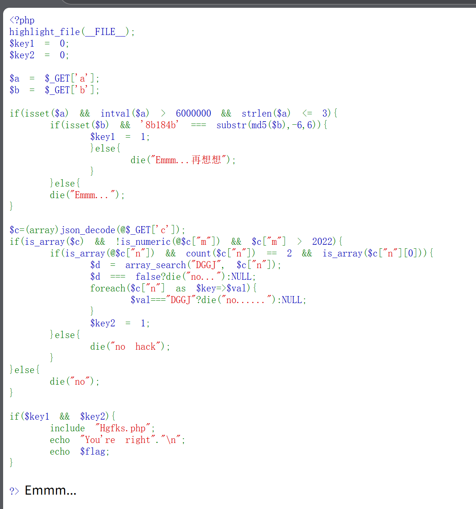
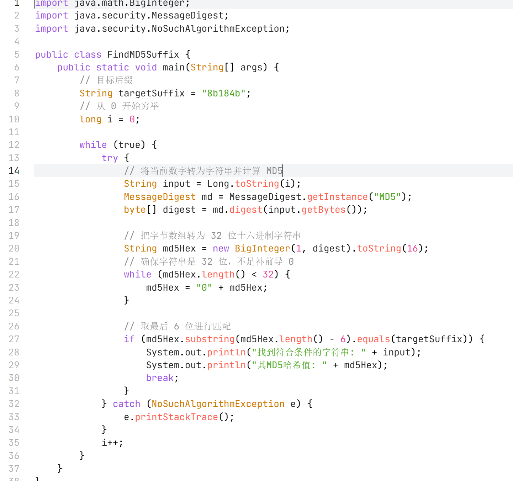
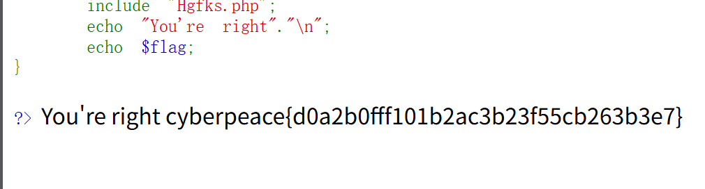
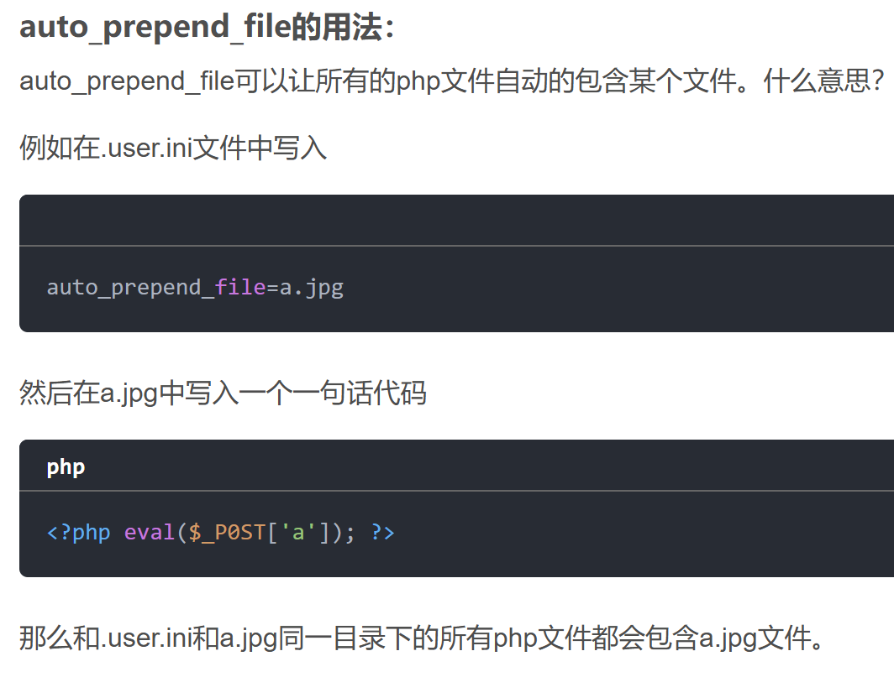
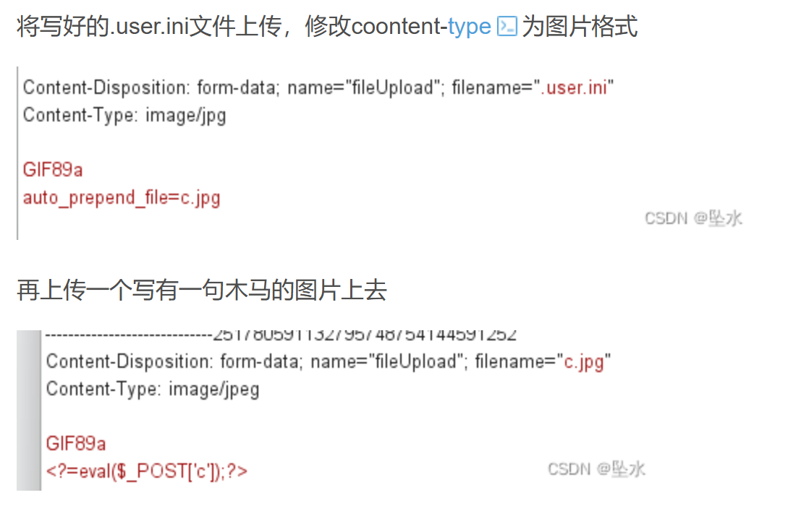
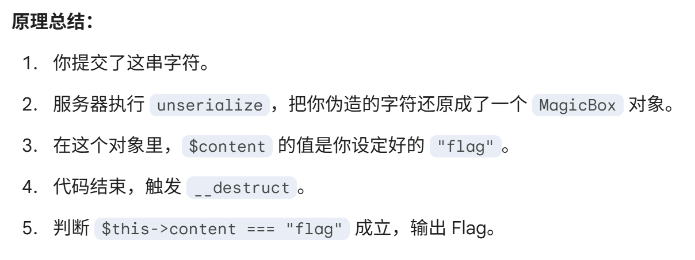
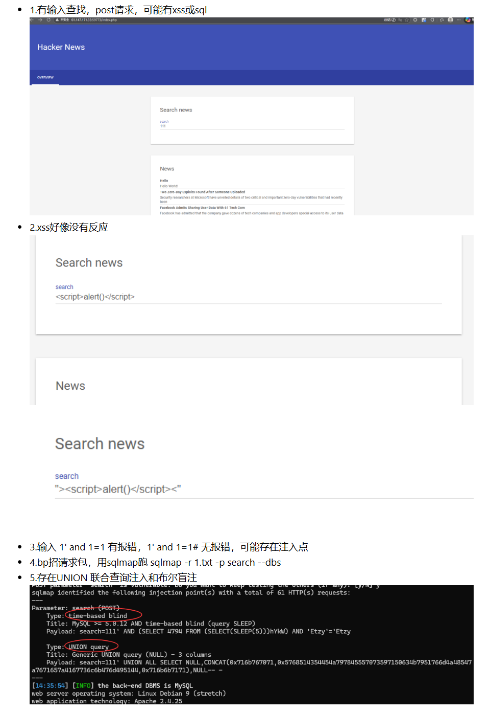
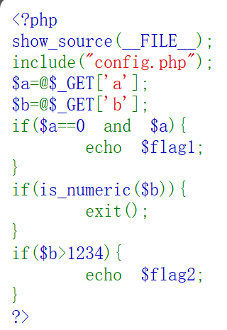
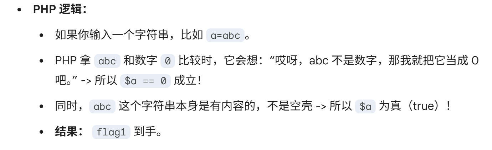

> 01.30.1
# easyphp
- 1.应该是php绕过，需要```$key1 && $key2```都是true才能返回glag

- 2.而且get传参需要三个参数abc
- 3.a：要求：a必须存在，转换为整数后大于6000000，且字符串长度≤3
- 4.要求：b必须存在，且其md5哈希值的最后6位必须是'8b184b'
- 5.要求：c必须是数组；c["m"]不能是数字或数字字符串；c["m"]的值要大于2022；要求：c["n"]必须是数组；数组长度必须为2；c["n"][0]必须是数组
- 6.开始构造参数：a是1e9（科学计数法的简写形式）。b是要写代码穷举。c是```{"m":"2023a","n":[[1,2],0]}```

- 7.payload是```?a=1e9&b=53724&c={"m":"2023a","n":[[1,2],0]}```


>01.30.2
# easyupload
- 1.像是文件上传漏洞，但是.php文件无法上传

- 2.查了文章

- 3.那就用这种方法，先用user.ini使得可以上传文件，再写一个一句话木马，用图片文件头欺骗

- 4.最后，蚁剑链接

>01.30.3
# 小白php
- 1.先分析源码：
```<?php
// 1. 显示当前文件的源码，方便你分析
highlight_file(__FILE__);

class MagicBox {
    // 这是一个属性，默认指向 "hello.txt"
    public $content = "hello.txt";

    // 2. 魔术方法 __destruct
    // 当这个对象被销毁（代码运行结束）时，这个函数会自动执行
    public function __destruct() {
        // 如果 content 的值等于 "flag"，就给你 Flag
        if($this->content === "flag") {
            echo "恭喜！Flag是: CTF{Simple_Deserialize_Success}";
        } else {
            echo "只是一个普通的文件: " . $this->content;
        }
    }
}

// 3. 接收用户输入的参数 'data'
$input = $_GET['data'];

// 4. 反序列化操作（漏洞点）
// 只要你传了参数，我就把它从“字符串”还原成“对象”
if(isset($input)){
    unserialize($input);
}
?>
```
- 2.这是一个很典型的php反序列化题目，直接构造即可
- 3.生成脚本
```<?php
// 1. 把题目里的类抄下来
class MagicBox {
    public $content = "flag"; // 2. 这里修改成我们想要的值！
}

// 3. 实例化这个类
$obj = new MagicBox();

// 4. 进行序列化，打印出攻击字符串
echo serialize($obj);
?>
```
- 4.

>01.30.4
# newcenter



>01.30.5
# simple_php
- 1.感觉像php返序列化

- 2.get传参，需要ab两个参数。
- 3.a又要等于0，又要为真。查资料

- 4.b不能纯数字，又要比1234大
- 5.payload出两个答案，合并就是flag