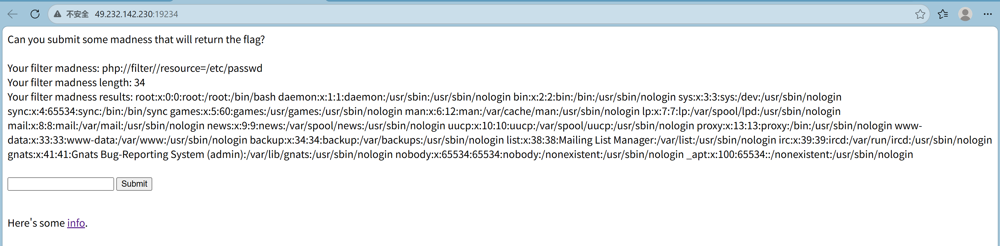
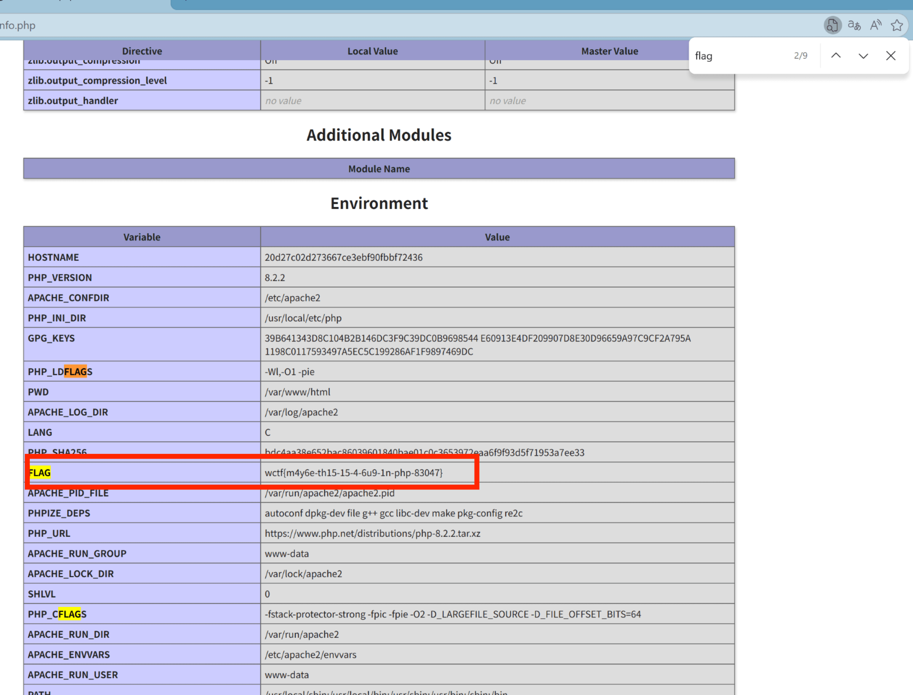
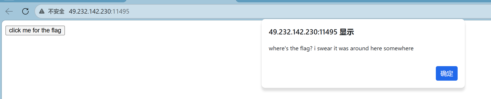
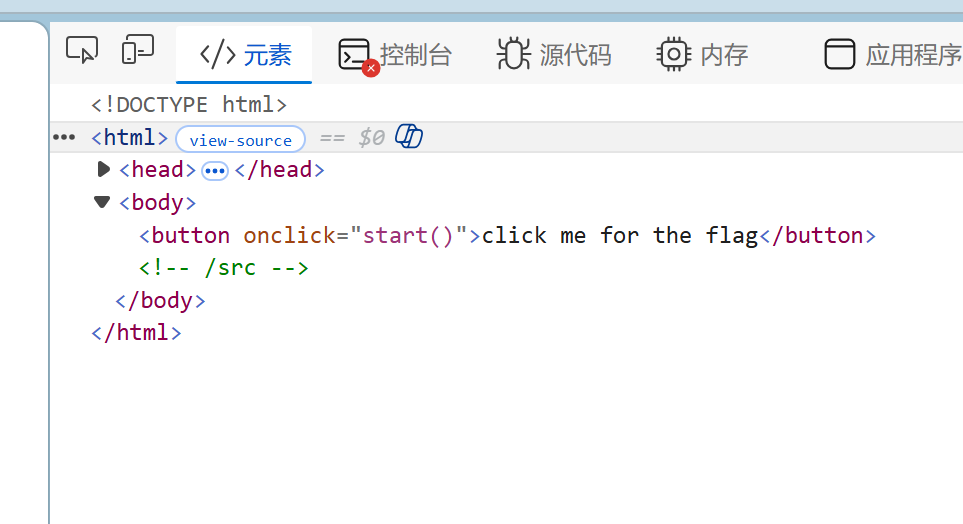
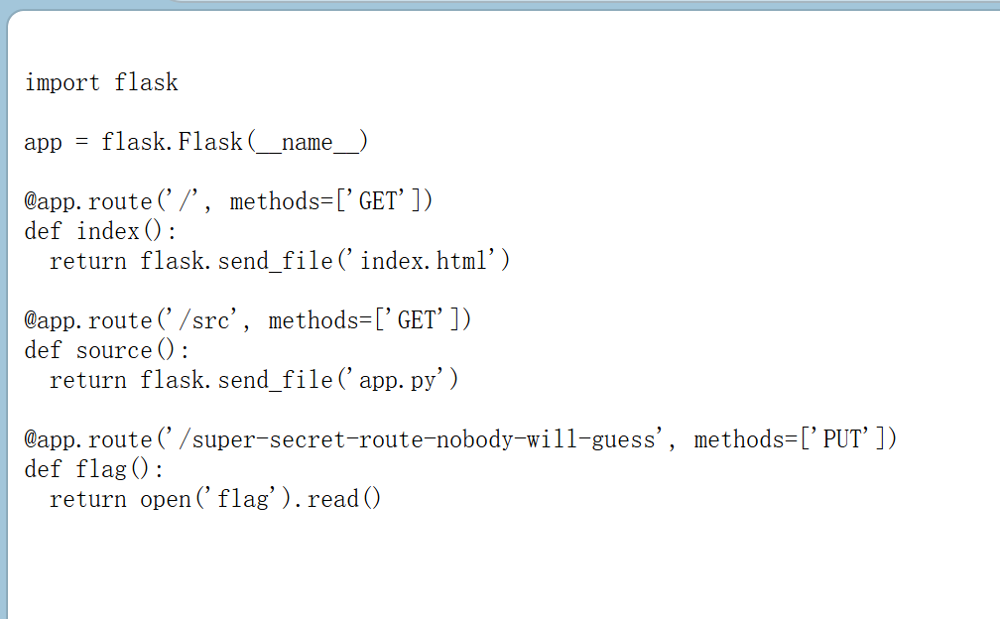
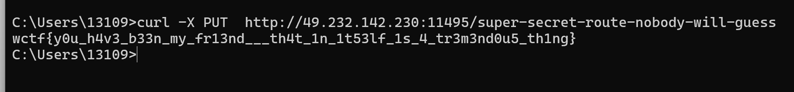

#### [Bugku]filter-madness

1.点击info

Ctrl+F搜索flag,向下查找flag

#### [Bugku]charlottesweb

1.首先按照他的提示点进去

没看到有用信息

2.查看源代码

3.在url里添加/src

这里写着/scr用get方式返回一个文件，发送一个请求给/supper-secret-route-nobody-will-guess以put的方式发送

4.用linux系统发送一个请求（按win+R,输入cmd打开命令提示符，执行以下命令）

